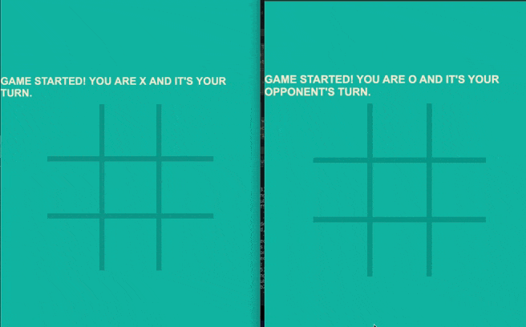

#  Tic Tac Toe WebSocket API    

## Overview

The Tic Tac Toe WebSocket API facilitates real-time interaction in a Tic Tac Toe game through WebSockets, allowing for live updates and interactive gameplay without the need for continuous polling.



## Technologies Used


- **NestJS version:** 10.3.8
- **Socket.IO version:** 4.7.5
  - Important: To ensure compatibility, the Socket.IO client version must match the server version. You can use the following CDN for the client:
    ```html
    <script src="https://cdnjs.cloudflare.com/ajax/libs/socket.io/4.7.5/socket.io.js"></script>
    <link rel="stylesheet" href="./style.css">
    ```
  - Alternatively, you can install it via npm:
    ```bash
    npm install socket.io@4.7.5
    ```

## Installation

Clone the repository and navigate into the directory:

```bash
git clone https://github.com/masechkacat/tic-tac-toe-server.git
cd tic-tac-toe-server
```

### Install dependencies:
```bash
npm instal
```
Set the CORS_ORIGIN in your environment variables to specify the URL of the client from which requests are made (it is recommended to keep CORS enabled for production):
```bash
CORS_ORIGIN="http://example.com"
```
## Running the Server
To start the server in different environments:
```bash
# Development
npm run start

# Watch mode
npm run start:dev

# Production mode
npm run start:prod
```
## Testing
Run unit tests with:
```bash
npm run test
```
Tests are written for both the game service and the gateway.

## Documentation
The server's API is documented using AsyncAPI. Documentation is auto-generated by script `.github/workflows/asyncapi-docs.yml` and published via GitHub Actions to: [Tic Tac Toe WebSocket API 1.0.0](https://masechkacat.github.io/tic-tac-toe-server/)

You can also view the documentation locally using the [AsyncAPI Viewer](https://studio.asyncapi.com/) by loading the `asyncapi.yaml` file from the repository.

## Example Client
A simple client implementation is deployed at [client](https://masechkacat.github.io/tic-tac-toe-client/)

## Server Usage Information

- **Development Server:** [Tic Tac Toe Multiplayer](https://tic-tac-toe-server-a5g5.onrender.com)
- **Protocol:** *WebSocket (ws)*

## WebSocket Channels and Messages

### General Channel Access

- **Path:** `/`

### Subscriptions

Users can subscribe to receive updates which include the game state and other messages:

- **Game Updates**
  - **Description:** Receive current game status, including board state and current player turn.
  - **Payload:** Includes `status`, `board`, `currentPlayer`, and `playerIds`.
  
- **Messages**
  - **Description:** Receive general messages from the server.
  - **Payload:** Includes `text` which provides information or feedback.

- **Game Over**
  - **Description:** Notifies when the game ends, either by winning or draw.
  - **Payload:** Includes `text` which declares the game result.

- **Errors**
  - **Description:** Error messages in case of invalid moves or server issues.
  - **Payload:** Includes `message` detailing the error encountered.

### Publishing

Users can send moves to the server:

- **Move**
  - **Description:** Send player moves to the server.
  - **Payload:** `index` indicating the position on the board (0-8).


## License


